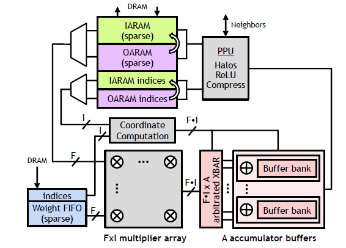

## SCNN: An Accelerator for Compressed-sparse CNNs

### Comment

This paper made me know it's possible to design a CNN accelerator without DDR communication overhead. Actually, for VGG, the maximum output feature storage is 6M (conv1). Moreover, if feature map after ReLU is highly sparse, it's very possible to deploy the CNN in FPGA without DDR read/write for feature map.

### Questions

- **What's the special design of the architecture and dataflow in this paper?**

This paper **gate and skip** the multiplication ops for both **features and weights**. In some previously design, like **Cambricon-X**, ops related to **weights** are **gated and skipped**, not for **features**. It is useful when weights are highly sparse, like FC layers in most CNNs. In **Cnvlutin**, only ops related to sparse **features** are **gated and skipped**. It is often used in convolutional layers.

When the ops are **gated**, it can save unnecessary energy. While, it cannot greatly speed up the operations, since it still take time to deal with the zero-weight/feature situations. When the ops are **skipped**, things are different. First, unnecessary feature/weights won't be read into On-chip buffers, so it can greatly save energy cost for DDR communication. Second, unnecessary ops can be skipped, so the operation can be speed up, since we needn't take some to deal with zero-weight/feature situations.

Besides, if features and weights are highly sparse, we actually needn't write intermediate feature data to off-chip, like DDR. So, we actually can design a non-DDR system to significantly reduce the cost of DDR data transmission.

- **Are there some drawbacks in this architecture?**

**YES**! Based on the analysis in this paper, we know that this architecture can greatly reduce the latency and energy cost in case features and weights are highly sparse. However, when the features and weights are dense (density > 0.8), no matter the energy cost and latency is higher than the normal dense architecture, even compared with the sparse architecture with only **gate** ops and dot product design. 

The reason is as follow:

**First**, when features and weights are dense, the energy cost for storing the index of non-zero features and weights cannot be ignores. It will be a big additional energy-consuming source of the systems.

**Second**, Unlike usual **dot product** in some sparse architecture, the **Cartesian product** in the paper have obvious drawbacks when data is dense. As show in the figure below, **Cartesian product** assumes that different multiplier probably target for different output values when data is highly sparse. Therefore, during writing to **Buffer bank** in this figure, $F*I$ data actually can be writing to its address in one clock period without **contention among products that hash to the same accumulate bank**. But This assumptions fails when data is dense. So, it will take more time to write data to corresponding bank due to **contention among products**, leading a high latency. 

**Third**, in the experiment, we can see that **average multiplier array utilization** vary greatly, causing a unstable computing performance. It also cause a big latency to overall operations. When PEs processing different tiles of input feature, different PE probably take different clock cycles. Therefore, early-finishing PEs have to wait for the laggards, causing a low PE utilizations. Besides, in a PE, **the working set allocated to each PE tends to be smaller in the later layers than in the earlier layers. As a result, assigning enough non-zero activations and weights in the later layers to fully utilize a PE’s multiplier array becomes difficult. In other words, SCNN can suffer from intra-PE fragmentation when layers do not have enough useful work to fully populate the vectorized arithmetic units.** 